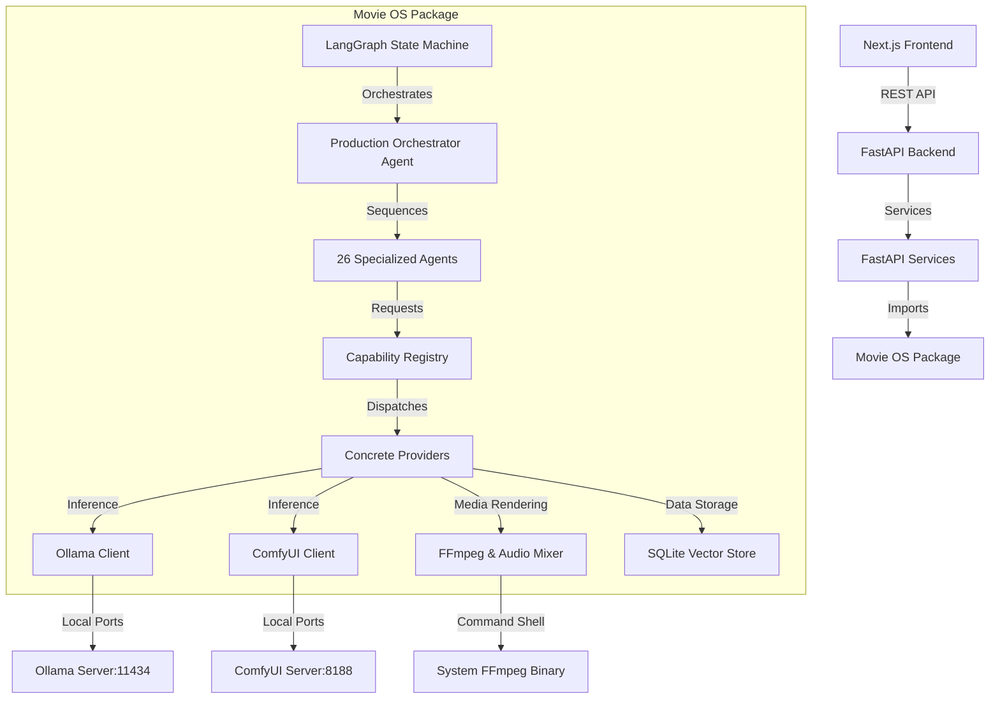

# Repository Analysis - Movie OS Cinema Production Engine
---

## Project Purpose
The Movie OS Cinema Production Engine is a local-first video generation pipeline designed to create cinematic psychological stories. It uses a capability-centric plug-in architecture, enabling each step of the video production pipeline (text outlines, screenplay, voice, music, visual rendering, composting, and evaluation) to run using modular capability providers. The engine is governed by **Production Grammars** (primarily `psychological_cinema`) that define cinematic styling parameters (e.g. aspect ratio, lighting style, color grading, pacing, volume levels, and voice narrator speed) to ensure consistent, premium-grade cinematic outputs.

---

## Core Architecture
The repository uses a multi-layered capability-centric architecture:
```
Domain Model          (Pydantic schemas — story, characters, environments)
    ↓
Capability Registry   (Abstraction layer wrapping core intents)
    ↓
Provider              (Implementations dispatching to local/remote models)
    ↓
Workflow              (ComfyUI JSON nodes / programmatic ffmpeg composition)
    ↓
Model                 (FLUX.1, SDXL, EdgeTTS, Qwen2.5, Deepseek Coder)
    ↓
Multi-Agent Layer     (LangGraph orchestrator managing agent states)
    ↓
Asset Store           (SQLite vector DB storing metadata & embeddings)
```

Two architectural paths are currently coexisting:
1. **Legacy path** (backward compatible): Runs sequential script executions (`psychological_pipeline.py`) routing data from story_factory generators to local generators and FFmpeg compositors.
2. **New path** (Cinema Production Engine): Runs a LangGraph state machine directed by a `ProductionOrchestratorAgent` across 26 distinct creative, planning, generation, post-production, evaluation, and revision agents.

---

## Bounded Contexts
The codebase is divided into several bounded contexts:
1. **Domain Model**: Defines the vocabulary of the production engine (e.g. Acts, Scenes, Shots, CharacterDNA, EnvironmentDNA, PromptTemplates, and Assets).
2. **Configuration & Defaults**: Validates runtime parameters via `MovieOSConfig` schemas.
3. **Capabilities & Providers**: Decouples capability requests from concrete provider backends (e.g. image generation is abstracted, with SDXL and ComfyUI/FLUX implemented as concrete providers).
4. **Agent Orchestration**: Wires LangGraph state transitions, fanning out story outlines to creative writing, generation prep, visual/voiceover rendering, evaluation checks, and revision loops.
5. **Asset & Data Layer**: Maintains persistent YAML registries for characters and environments, along with a vector SQLite asset database for semantic searches.
6. **Media Processing Infrastructure**: Directs system-level audio mixing and video compositing calls through FFmpeg wrappers.
7. **FastAPI & Next.js User Interface**: Powers Web-based dashboard controls, progress indicators, and asset reviews.

---

## Repository Layout
- `movie_os/`: Main modular package directory.
  - `domain/`: Pydantic model schemas.
  - `config/`: Configuration validators and defaults.
  - `capabilities/`: Capability registry interfaces.
  - `providers/`: Concrete model wrappers.
  - `agents/`: Agent roles and LangGraph wiring.
  - `infra/`: FFmpeg and sound mixing engines.
  - `llm/`: Ollama and ComfyUI REST/socket clients.
  - `asset_store/`: SQLite vector search.
  - `data_layer/`: Characters/environments persistence.
  - `grammars/`: Production grammar YAML files.
  - `workflows/`: ComfyUI JSON templates.
  - `tests/`: Unit and integration pytest files.
- `backend/`: FastAPI application directory hosting routing endpoints, services, and schemas.
- `frontend/`: Next.js web application files.
- `docs/`: Plans, design drawings, specs, and PRDs.
- `pipeline/` & `story_factory/` & `openmontage_adapter/`: Legacy pipeline components and adapter shims.
- `scripts/`: Maintenance, setup, and assembly scripts.
- `tests/`: Root-level integration and performance test files.

---

## Frameworks & Languages
- **Programming Languages**: Python (backend/core/scripts), TypeScript (frontend views), JavaScript (build configurations), Bash (shell scripts).
- **Core Frameworks**: FastAPI (backend APIs), Next.js (frontend client), React (UI), LangGraph (agent orchestration state machine), Pydantic v2 (schema checking).
- **Machine Learning**: PyTorch, HuggingFace Diffusers, Transformers, Accelerate (local image generation).
- **Audio Engines**: Coqui TTS, Microsoft Edge TTS API, NumPy (procedural synthesis).
- **Testing**: pytest (Python), Playwright (E2E), Vitest (JS/TS unit).

---

## Package Managers & Build System
- **Python**: Managed using Python virtual environment (`venv`) loaded via `requirements.txt` and `pyproject.toml` configurations (using setuptools).
- **Frontend**: Managed via `npm` (indicated by `package-lock.json` in `frontend/`).
- **Formatting & Linting**: Black, Flake8, Mypy, and Pylint are configured in `pyproject.toml` for the Python codebase.

---

## Dependency Graph


---

## APIs Catalog
1. **Projects Endpoint (`/api/v1/projects`)**: Creation, lists, retrieval, updates, deletion, and sub-story indexing of workspaces.
2. **Pipeline Endpoint (`/api/v1/pipeline`)**: Initiates video rendering runs, checks execution logs, serves audio/video scene clips, and handles retries.
3. **Ollama REST (`http://localhost:11434`)**: Generates text screenplays and characters through `/api/chat` and `/api/generate` APIs.
4. **ComfyUI REST & WebSocket (`http://localhost:8188`)**: Queues FLUX workflows and retrieves rendered visuals.

---

## Testing Strategy
- **Python Unit Testing**: Leverages `pytest` executing 399+ unit and integration tests defined in `movie_os/tests/` verifying schemas, prompt renders, registries, database lookups, and graph traversals.
- **Frontend Validation**: Employs `Vitest` for client-side unit testing.
- **End-to-End browser validation**: Uses `Playwright` to run mock visual clicks against the Next.js frontend pages.

---

## Security Strategy
- **Code Scan**: GitHub Actions workflow (`.github/workflows/security.yml`) executes `pip-audit` checks to scan third-party Python packages for vulnerabilities during push and pull requests on the `main` branch.
- **Data Validation**: Enforces strict input validation on REST payloads using Pydantic models.
- **Isolation**: Prioritizes local network models (Ollama, ComfyUI, procedural audio) to restrict data leakage to external networks.

---

## AI Workflows
The multi-agent execution pipeline follows this workflow path:
1. **Creative Phase**: ResearchAgent → StoryArchitectAgent → PsychologyReviewerAgent.
2. **Writing Phase**: ScreenplayWriterAgent → DialogueWriterAgent.
3. **Planning Phase**: ScenePlannerAgent → ShotPlannerAgent → PromptBuilderAgent → MusicComposerAgent.
4. **Generation Prep Phase**: CharacterManagerAgent → EnvironmentManagerAgent.
5. **Generation Phase**: ImageGeneratorAgent (FLUX ComfyUI) → VoiceGeneratorAgent (EdgeTTS) → MusicGeneratorAgent.
6. **Post-Production Phase**: AudioMixingAgent → VideoComposerAgent → SubtitleAgent.
7. **Evaluation Phase**: StoryQualityAgent, DialogueQualityAgent, VisualConsistencyAgent, AudioMixAgent, EmotionScoreAgent, CharacterConsistencyAgent.
8. **Publishing Readiness**: YouTubeReadinessAgent.
9. **Revision Loop**: If evaluation metrics fall below grammar thresholds, RevisionAgent re-runs the failed steps.

---

## Technical Debt & Observations
1. **Graph Configuration Bug (`graph.py`, line 111)**: Wires `config.get("grammar")` which fails with `AttributeError` when `config` is a Pydantic `MovieOSConfig` object instead of a dictionary.
2. **Ollama Legacy Client Fallback Bug (`client.py`, line 114)**: Invokes `self._generate_legacy_chat_to_generate(...)` which is not defined on the `LLMClient` class (the defined method is `_generate_legacy`), causing immediate code crashes.
3. **Redundant Code Scripts**: Multiple duplicate scripts reside under the root `scripts/` folder (e.g. `final_assemble.py` through `final_assemble_v6.py`), showing a lack of pruning during development.
4. **Incomplete Edge TTS, ComfyUI, & Ollama server checks**: Stubs are utilized inside the test suites to simulate GPU generation, hiding potential live port binding issues.
