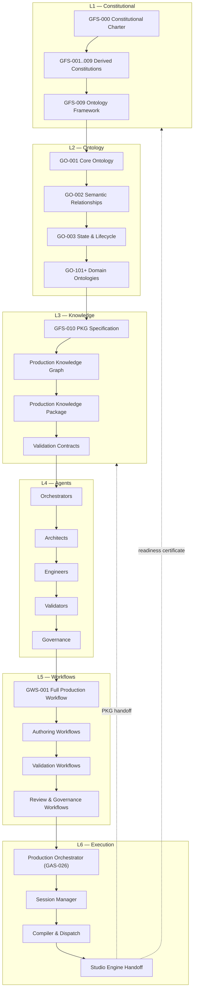

Genesis Diagram (GD)
GD-001 — Genesis Layer Diagram

Document ID: GD-001
Title: Genesis Layer Diagram
Version: 1.0.0
Status: Reference Diagram
Authority: Derived from GFS-000, GO-001, GAS-026

1. Purpose

This diagram captures the six-layer architecture of the Genesis Engine and the
data flow that crosses them. It is the canonical reference for understanding
where any concept, document, agent, or workflow belongs inside the system.

The layers are strict: every artifact in the repository belongs to exactly one
layer, and every layer depends only on the layers beneath it. No layer may
reach above itself, and no layer may skip the layer immediately beneath it.

2. The Six Layers

L1 — Constitutional
    The Charter (GFS-000), the derived constitutions (GFS-001 through GFS-009),
    and the Constitutional Ontology Framework (GFS-009). This layer defines the
    immutable invariants, the principles, and the governance authority for
    every other layer. Nothing in Genesis may override this layer.

L2 — Ontology
    The Core Ontology (GO-001), the Semantic Relationship Catalog (GO-002),
    the State & Lifecycle Ontology (GO-003), and every domain ontology
    (GO-101+). This layer defines the canonical vocabulary and grammar that
    every higher layer must speak.

L3 — Knowledge
    The Production Knowledge Graph specification (GFS-010), the Production
    Knowledge Package (PKP) format, the validation rules, and the registry
    contracts. This layer is where concepts become instances — the single
    source of truth.

L4 — Agents
    The Agent Constitution (GFS-005) and every agent specification
    (GAS-001 through GAS-027). Agents are the active workers that read from
    and write to the Knowledge layer. They have no authority outside their
    declared constitutional class.

L5 — Workflows
    The Full Production Workflow (GWS-001) and every derived workflow
    (authoring, validation, review, generation, publication). Workflows
    compose agents into ordered, observable production processes.

L6 — Execution
    The runtime surfaces: orchestrators, session managers, dispatchers,
    compilers, and integration adapters. This is where Genesis meets the
    outside world — including the handoff boundary to the Studio Engine.

3. Data Flow

The primary data flow is top-down for authority and bottom-up for value.

    Authority flows down:    L1 → L2 → L3 → L4 → L5 → L6
    Value flows up:          L6 → L5 → L4 → L3 → L2 → L1 (feedback only)

A production session consumes authority downward and produces value upward.
No layer may bypass a layer below it. A workflow (L5) cannot invent a new
ontology class; it must use one already defined in L2. An agent (L4) cannot
declare a new constitutional principle; it must operate within L1.

4. Mermaid Diagram

5. Cross-Layer Rules

- A layer may only reference documents in its own layer or below.
- A layer may only emit artifacts to its own layer or above.
- The Constitutional layer is immutable under normal evolution; it changes
  only through the constitutional amendment process defined in GFS-009.
- The Ontology layer evolves additively; existing concepts are never
  redefined, only extended or deprecated.
- The Knowledge layer is per-production; each production owns its own PKG.
- The Agent layer is stable; new agents are added, existing agents are
  deprecated, but agent roles are not merged.
- The Workflow layer is composable; new workflows are combinations of
  existing agents and sub-workflows.
- The Execution layer is replaceable; runtime technology may change without
  affecting any higher layer.

6. Reading the Diagram

When tracing where a concept belongs:

- If it is a principle, invariant, or governing rule → L1.
- If it is a noun, a relationship, or a vocabulary term → L2.
- If it is a graph instance, a node, or a subgraph → L3.
- If it is a role with inputs, outputs, and quality criteria → L4.
- If it is an ordered sequence of agent invocations → L5.
- If it is a process that runs, dispatches, or hands off → L6.

7. Boundary With the Studio Engine

The diagram's lowest edge (E4) is the Genesis boundary. Everything above it
is Genesis. Everything below it is the Studio Engine, which begins only
after Genesis certifies production readiness via a PKP and a signed
validation certificate. No media generation capability exists above this
edge; this separation is absolute per GFS-000 §15.