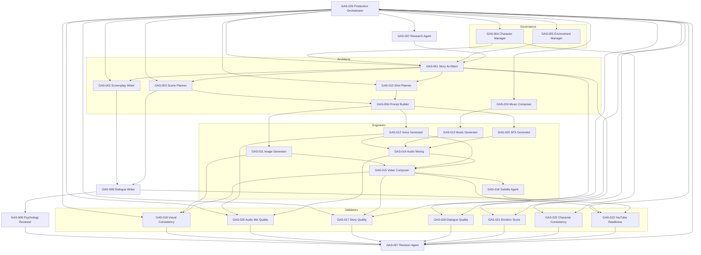

Genesis Diagram (GD)
GD-002 — Agent Dependency Graph

Document ID: GD-002
Title: Agent Dependency Graph
Version: 1.0.0
Status: Reference Diagram
Authority: Derived from GFS-005, GAS-001 through GAS-027

1. Purpose

This diagram shows every agent in the Genesis Engine and the dependencies
between them: which agent triggers which, which agent consumes the output of
which, and which agents operate as peers within the same production phase.

It is the canonical reference for understanding the dispatch graph used by the
Production Orchestrator Agent (GAS-026). Every arrow represents a "depends on"
or "is triggered by" relationship, not a temporal sequence. Temporal order is
defined by the workflows in L5, not by this graph.

2. Agent Inventory (27 agents)

Orchestrators (2)
- GAS-026 Production Orchestrator Agent
- GAS-027 Revision Agent

Architects (6)
- GAS-001 Story Architect Agent
- GAS-002 Screenplay Writer Agent
- GAS-003 Scene Planner Agent
- GAS-006 Prompt Builder Agent
- GAS-010 Shot Planner Agent
- GAS-024 Music Composer Agent

Governance (2)
- GAS-004 Character Manager Agent
- GAS-005 Environment Manager Agent

Researchers (1)
- GAS-007 Research Agent

Shared (1)
- GAS-008 Dialogue Writer Agent

Reviewers (1)
- GAS-009 Psychology Reviewer Agent

Engineers (7)
- GAS-011 Image Generator Agent
- GAS-012 Voice Generator Agent
- GAS-013 Music Generator Agent
- GAS-014 Audio Mixing Agent
- GAS-015 Video Composer Agent
- GAS-016 Subtitle Agent
- GAS-025 SFX Generator Agent

Validators (7)
- GAS-017 Story Quality Agent
- GAS-018 Dialogue Quality Agent
- GAS-019 Visual Consistency Agent
- GAS-020 Audio Mix Quality Agent
- GAS-021 Emotion Score Agent
- GAS-022 Character Consistency Agent
- GAS-023 YouTube Readiness Agent

3. Dependency Rules

- Every agent is dispatched by GAS-026 or by another agent explicitly
  authorized to dispatch (architects may dispatch engineers within their
  phase; validators may dispatch the Revision Agent).
- Architects depend on governance managers for canonical subgraphs.
- Engineers depend on architects for specifications and on governance
  managers for canonical assets.
- Validators depend on engineers for outputs and on architects for the
  intended specification.
- The Revision Agent (GAS-027) is triggered by any validator that detects
  a defect that can be corrected within Genesis.

4. Mermaid Diagram

5. Trigger Semantics

- Solid arrows mean "is triggered by" or "consumes output of."
- The orchestrator triggers every top-level agent; it does not pre-declare
  every transitive dispatch — architects may dispatch engineers within
  their phase, and validators may dispatch the Revision Agent.
- The Revision Agent reports back to the orchestrator, closing the loop.
- No agent may dispatch the orchestrator. The orchestrator is the root of
  the dispatch tree.

6. Parallelism

Agents without a dependency edge between them may run in parallel. The
orchestrator and the workflows in L5 are responsible for identifying these
opportunities. Typical parallel groups include:

- Governance managers (GAS-004, GAS-005) at session start.
- Engineers (GAS-011 through GAS-016, GAS-025) during the producing phase
  once prompt specifications are ready.
- Validators (GAS-017 through GAS-023) during the evaluating phase once
  the relevant engineer output is available.

7. Cycle Policy

The dependency graph is acyclic by construction, with one controlled
exception: the Revision Agent. When a validator detects a defect, it may
trigger GAS-027, which in turn re-dispatches the responsible architect
or engineer through the orchestrator. This forms a bounded repair cycle
that terminates when all validators pass or when the orchestrator declares
the defect unrecoverable and escalates to governance.