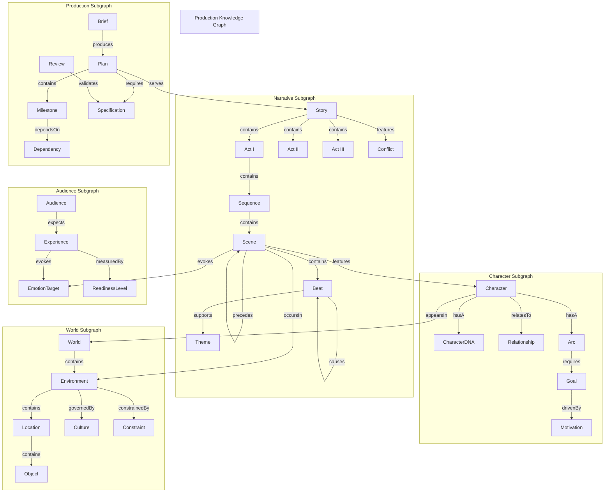

Genesis Diagram (GD)
GD-003 — PKG Structure Diagram

Document ID: GD-003
Title: Production Knowledge Graph Structure Diagram
Version: 1.0.0
Status: Reference Diagram
Authority: Derived from GFS-010, GO-001, GO-002

1. Purpose

This diagram shows the structural anatomy of the Production Knowledge Graph
(PKG): the subgraphs it must contain, the canonical node types within each
subgraph, the edges that connect them, and the confidence levels that every
node and edge carries.

The PKG is a directed labeled property graph (per GFS-010 §3). This diagram is
a visual reference; the formal, machine-checked contract is GFS-010 itself.

2. Mandatory Subgraphs

Every certified PKG must contain at least the following five subgraphs. A
subgraph is a named, versioned collection of nodes and edges that represents a
complete production concern.

- Narrative Subgraph — the story spine.
- Character Subgraph — every intentional participant.
- World Subgraph — environments, locations, temporal context.
- Audience Subgraph — target audience and intended experience.
- Production Subgraph — schedule, resources, dependencies, milestones.

3. Canonical Node Types Per Subgraph

Narrative Subgraph
- Story
- Act
- Sequence
- Scene
- Beat
- Theme
- Conflict

Character Subgraph
- Character
- CharacterDNA
- Relationship
- Arc
- Goal
- Motivation

World Subgraph
- World
- Environment
- Location
- Object
- Culture
- Constraint

Audience Subgraph
- Audience
- Experience
- EmotionTarget
- ReadinessLevel

Production Subgraph
- Brief
- Plan
- Milestone
- Dependency
- Specification
- Review

4. Canonical Edge Types

Edges come from the Semantic Relationship Catalog (GO-002). The most common
edges inside the PKG are:

- go:contains        — parent contains child (Story contains Act)
- go:partOf          — inverse of contains
- go:precedes        — temporal order (Scene precedes Scene)
- go:causes          — causal chain (Beat causes Beat)
- go:features        — a Scene features a Character
- go:occursIn        — a Scene occursIn an Environment
- go:evokes          — a Scene evokes an EmotionTarget
- go:supports       — a Beat supports a Theme
- go:dependsOn       — a Milestone dependsOn another Milestone
- go:requires        — a Plan requires a Specification
- go:validates       — a Review validates a Specification

5. Confidence Levels

Every node and every edge carries a confidence property drawn from the
canonical set defined in GFS-000 §10 and refined in GO-001 §7:

- EXPLICIT   — stated directly in the source material (the brief).
- INFERRED   — derived by an agent from evidence in the PKG.
- CONFIRMED  — validated by a validator agent or by the creator.
- ASSUMED    — adopted without evidence; must be flagged for review.
- UNKNOWN    — gap detected; the discovery loop must resolve this.

A PKG may not be certified while any node on a critical path carries
UNKNOWN confidence.

6. Mermaid Diagram

7. Reading the Diagram

Each subgraph is internally consistent and owns its own node namespace.
Cross-subgraph edges (the arrows that leave a subgraph) are the integration
points. They are the most valuable edges in the PKG because they carry the
meaning that connects isolated concerns into a single coherent production.

The color classes at the bottom of the diagram map to confidence levels.
When reading any node, the confidence is as important as the type: a Scene
with UNKNOWN confidence is not yet a scene; it is a hypothesis.

8. Validation Surfaces

The diagram implies the validation contract from GFS-010 §5:

- Structural: every edge's source and target must exist.
- Semantic: no contradictory edges (a Character cannot both features and
  opposes the same Scene without a recorded reason).
- Completeness: every subgraph meets its minimum node count.
- Confidence: no critical-path node carries UNKNOWN at certification.

9. Relationship to the Production Knowledge Package

The PKG is the live, mutable graph during a session. When the orchestrator
certifies production readiness, the PKG is frozen into a Production Knowledge
Package (PKP) — an immutable, signed, distributable artifact. The diagram
above describes the structure of both; only the lifecycle state differs.