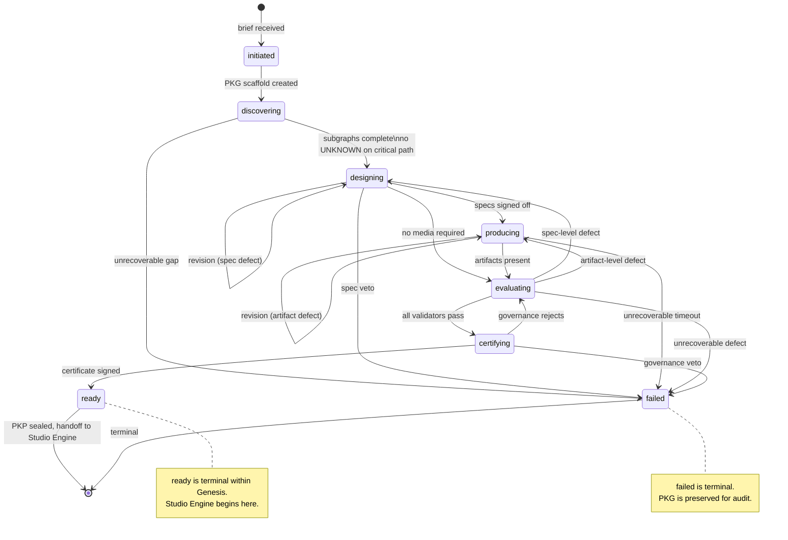

Genesis Diagram (GD)
GD-004 — Production Lifecycle State Machine

Document ID: GD-004
Title: Production Lifecycle State Machine
Version: 1.0.0
Status: Reference Diagram
Authority: Derived from GFS-000, GO-003, GAS-026

1. Purpose

This diagram defines the canonical lifecycle of a single production inside
Genesis. Every production moves through a fixed set of states. Transitions
are governed by the Production Orchestrator (GAS-026) and validated by the
State & Lifecycle Ontology (GO-003). A production may not skip a state, and
every transition is recorded in the PKG as a provenance event.

2. Canonical States

A production moves through seven states:

1. initiated        — the brief has been received; no work has begun.
2. discovering       — agents are extracting and inferring knowledge.
3. designing         — architects are producing specifications.
4. producing         — engineers are generating media artifacts.
5. evaluating        — validators are scoring outputs against specs.
6. certifying        — governance is reviewing and signing off.
7. ready             — the PKP is sealed and handed to the Studio Engine.

There is one terminal failure state:

8. failed            — an unrecoverable defect or veto has halted production.

3. Transition Rules

- initiated → discovering: the orchestrator has parsed the brief and
  created the initial PKG scaffold.
- discovering → designing: every mandatory subgraph exists with at least
  its minimum node count; no critical-path node carries UNKNOWN confidence.
- designing → producing: every specification referenced by the plan is
  present, internally consistent, and signed off by the relevant
  architect.
- producing → evaluating: every engineer artifact referenced by the plan
  is present and addressable.
- evaluating → certifying: every validator has returned a passing score
  against its target specification.
- certifying → ready: governance has signed the validation certificate
  and the PKP has been sealed.
- ready is terminal within Genesis. From here, the Studio Engine takes
  over.

Any state may transition to failed when:
- a validator detects an unrecoverable defect,
- the Revision Agent (GAS-027) cannot repair within budget,
- governance vetoes the production,
- or the orchestrator declares an unrecoverable timeout.

4. Repair Loops

Two bounded repair loops exist:

- evaluating → designing: a validator detects a specification-level
  defect. The relevant architect is re-dispatched via the Revision Agent.
- producing → producing: an engineer artifact fails a validator, but the
  specification is sound. The engineer is re-dispatched with the defect
  report.

Both loops are bounded by the Revision Agent's repair budget. When the
budget is exhausted, the production transitions to failed.

5. Mermaid Diagram

6. State Ownership

- initiated, certifying, ready, failed are owned by the orchestrator
  (GAS-026) and governance.
- discovering, designing, producing, evaluating are owned by the
  orchestrator, but the trigger conditions are evaluated by the relevant
  validators and architects.

No agent other than the orchestrator may declare a state transition. This
guarantees a single, auditable authority for lifecycle progression.

7. Provenance

Every transition is recorded as an edge in the PKG with:

- type: go:transitionedTo
- source_id: the previous state node
- target_id: the new state node
- confidence: EXPLICIT (transitions are explicit events)
- provenance: the agent that declared the transition
- properties: reason, validator reports (if any), timestamp

This provenance record is what the governance agent reviews during the
certifying state and what the audit log retains for any future
investigation.

8. Recovery From failed

A production in the failed state is not deleted. The PKG is preserved
read-only. A new production may be initiated that references the failed
PKG as provenance, allowing the creator to restart with prior knowledge
intact. The failed PKG never transitions out of failed; a new production
ID is issued instead.